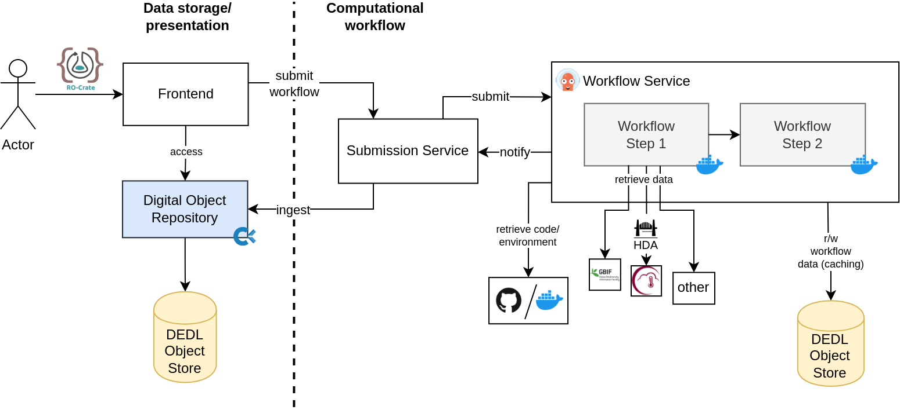

# A FAIR workflow platform for biodiversity digital twins

This FAIR workflow platform is developed as a solution
for executing and sharing [FAIR](https://www.go-fair.org/fair-principles/) (Findable, Accessible, Interoperable, Reuseable)
workflows across research domains.
It allows to execute and reuse machine-actionable workflows and resulting data,
encapsulated in [Research Object Crates (RO-Crates)](https://www.researchobject.org/ro-crate/)
and advertised via [FAIR Signposting](https://signposting.org/FAIR/).

## Features

- **Workflow Execution** Integrates with [Argo Workflows](https://argoproj.github.io/workflows/) for workflow execution.
- **RO-Crate compatibility**: End-To-End integration of RO-Crates
- **Digital Object Management**: Workflows and datasets are stored as Digital Objects using [Cordra](https://www.cordra.org/)
- **FAIR Signposting** on the frontend allows for integration of results into the semantic web.

## Architecture

The workflow platform follows a microservice architecture allowing components to be extended or replaced for flexibility. This repository incorporates each of these components as submodules. 

### Submodules

- **Frondend**: An interface for accessing data and executing workflows.
- **Cordra models**: Provides schema and metadata models for the digital object store.
- **Argo Workflow Connector**: An implementation of the `Submission service` that handles orchestration of Argo workflows for workflow execution.
- [**Crop wild relatives Workflow RO-Crate**](https://github.com/dnlbauer/cwr-workflow-ro-crate): A sample RO-Crate workflow that runs the [Crop Wild Relatives prototype Digital Twin](https://github.com/BioDT/uc-CWR). See [here](https://doi.org/10.3897/rio.10.e125192) for details. 

## Deployment at DestinE

A version of the platform is currently deployed to the [Destination Earth Platform](https://destination-earth.eu/) and can be accessed here: [Crop Wild Relatives](http://217.71.193.143/). 

### Deployment diagram

## License

Licensed under the [MIT](./LICENSE) license.

## References

If you want to cite this project, here are some references you can use:

- Dataspace Integration for Agrobiodiversity Digital Twins with RO-Crate [https://doi.org/10.3897/biss.8.134479](https://doi.org/10.3897/biss.8.134479)
- FAIR dataspace integration for Agrobiodiversity Digital Twins (Poster) [https://doi.org/10.5281/zenodo.13928654](https://doi.org/10.5281/zenodo.13928654)

## Funding

- EUMETSAT: Agriculture and Climate Change DEDL Use Case
- The European Commission: [BioDT – Biodiversity Digital Twin for Advanced Modelling, Simulation and Prediction Capabilities](https://biodt.eu/)
- The DFG as Part of [FAIRagro](https://fairagro.net/)
