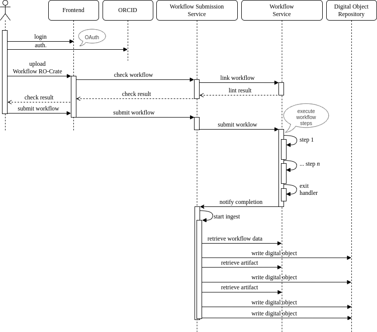
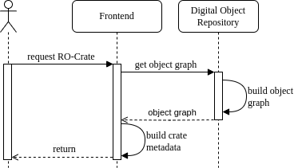
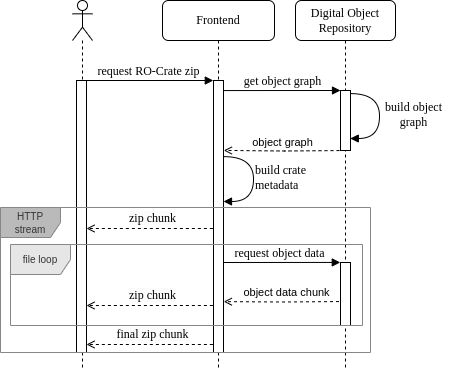
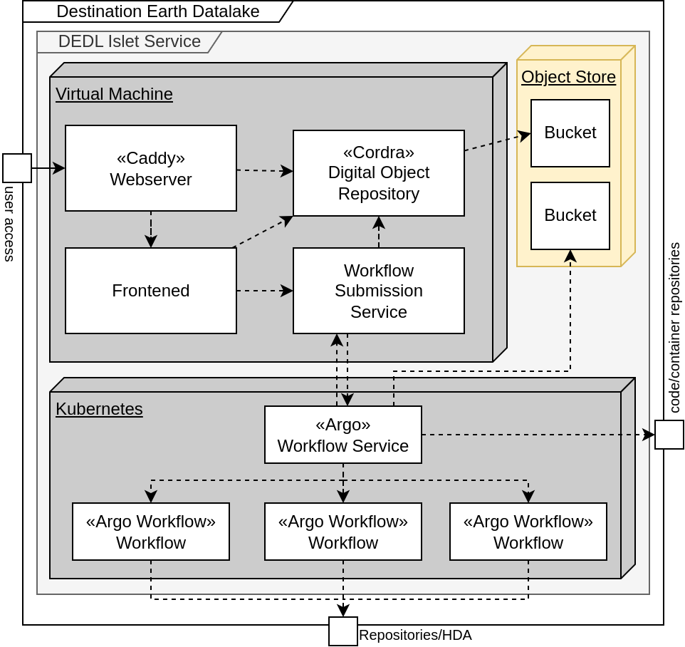

# FAIR Workflow platform architecture documentation

This document loosely follows the [ARC42](https://arc42.org/overview) template for architecture documentation.

It describes the architecture in the context of the [Destination Earth platform](https://destination-earth.eu/).

## 1. Overview

The FAIR Workflow Platform is designed to allow the execution
and sharing of machine-actionable workflows.
It adheres to the [FAIR principles](https://www.go-fair.org/fair-principles/) (Findable, Accessible, Interoperable, Reusable).
The platform follows an [RO-Crate](https://www.researchobject.org/ro-crate/)-centric approach.
Workflows can be submitted as RO-Crates and their output is available as RO-Crate as well.
By leveraging FAIR Signposting, it allows integrating resulting dataset in the greater linked data ecosystem.

### Key Features

- A user-facing frontend for workflow submission and viewing/retrieving datasets.
- Automatic tracking of workflow execution provenance.
- Datasets are available in a standardized format and described with rich metadata. This allows to share them across data spaces and research domains.

## 3. Context

The platform integrates the following external services:

- **ORCID**: For user authentication
- **Linked data context providers**: Provide JSON-LD context for handling metadata
- **S3 Storage**: Object storage for digital objects and workflow data.
- **External Data Repositories**: Workflows can access data from external providers like GBIF or the Copernicus Climate Data Store.
- **DEDL HDA Bridge**: Workflows can access earth observation data and the Destination Earth Digital Twins through the Harmonized Data Access API.
- **External code/container repositories**: Workflows can use code or the execution environment description (docker container) stored in external repositories like Github or Docker Hub.

Human users interact with the platform via the frontend, which handles authentication, workflow submission, and dataset retrieval. Users can also access the Digital Object repository directly. 

Machine agents can retrieve datasets in a machine-readable format through the frontend and Digital Object repository. FAIR signposting
links human-readable frontpages to the machine-readable datasets.

## 4. Solution Strategy

The solution is built with a microservice architecture.
This should ensure extensibility and allow for individual building blocks being replaced.

1. **Frontend:** Manages user interactions and submissions. Provides FAIR signposting to machine-readable content.
2. **Digital Object repository:** Stores datasets.
3. **Submission Service:** Acts as a bridge between the frontend, Digital Object repository and the workflow engine.
4. **Workflow Engine:** Executes workflows.

## 5. Building Blocks

### 5.1 Frontend

#### Responsibilities

- Allows users to login with ORCID.
- Provides a GUI for submitting workflows as RO-Crates and monitoring their progress.
- Displays datasets and their provenance.
- Dynamically builds RO-Crates for export and allows to download them or retrieve them as "detached" RO-Crate.
- Provides an admin interface for managing registered users.

#### Interactions

- Submits workflows and metadata to the submission service.
- Queries the Digital Object repository for digital objects.

#### Technical details

- Django frontend with small sprinkles of JavaScript.
- Uses ro-crate-py to build ro crates.

### 5.2 Digital Object repository (Cordra)

#### Responsibilities

- Stores digital objects for data, workflows and respective metadata.

#### Interactions

- Provides data to the frontend.
- Receives data from the submission service.

#### Technical details

- A cordra instance.
- Cordra schema closely resembles the profile of Workflow Run RO-Crates.
- Corda hooks written in Java/Kotlin ensure that all metadata documents are valid JSON-LD.
- Backed by an S3 Bucket for storage.

### 5.3 Submission Service (Argo Connector)

#### Responsibilities

- Orchestrates workflow submission and ingestion of results.

#### Interactions

- Retrieves workflow submissions from frontend and queues the workflow to the workflow engine
- Retrieves workflow results and metadata from the workflow engine upon completion
- Ingests workflows and artifacts into the Digital Object repository

#### Technical details

- Built with FastAPI
- Annotates workflow submissions with metadata for provenance.
- Reads workflow annotations and stored workflow archives from the engine and ingests them into cordra.

### 5.4 Workflow Service (Argo Workflow Engine)

#### Responsibilities

- Executes workflows
- Stored workflow artifacts for submission service
- Notifies the Submission service about finished workflows

#### Interactions

- Retrieves workflows from Submission services and notifies on workflow completion
- Stores workflow artifacts

#### Technical details

- Supports secure key management via Kubernetes secrets
- Automatically adds exit-handlers to submitted workflows to notify the submission service
- Archives workflow artifacts into an S3 bucket.

## 6. Runtime View

### 6.1 Workflow Submission

Workflow submission consists of multiple phases:
1. User authentication: This is a typical [SAML](https://en.wikipedia.org/wiki/Security_Assertion_Markup_Language) authentication flow with [orcid](https://orcid.org) as identity provider.
2. Workflow upload and validation:
The user uploads a Workflow RO-Crate to the frontend. The frontend extracts the workflow file and checks its validity against the Workflow Submission Service.
The result is reported back to the user.
3. Workflow submission and execution:
When the user submits the validated workflow, it is send to the Workflow Submission Service with additional provenance data
(i.e. user name).
The workflow submission service adds the provenance data as annotations to the workflow and queues the updated workflow to the Workflow Service.
The workflow steps get executed according to the workflow definition.
Finally, on successful completion, an exit handler is run that notifies the Workflow submission service about completion.
4. Ingestion of workflow results:
Upon retrieval of the notificaton from the exit handler,
the Workflow submission service is responsible for creating a dataset representing this run in the Digital Object Repository.
It first retrieves the workflow information which includes
a description of the workflow and the provenance data as annotations.
The Submission service subsequently builds Digital Objects for this data and adds them to the Digital Object Repository.
For all artifacts of the workflow, a Digital Object representing this artifact is created.
Finally, a Digital Object for the whole dataset is written, which makes the dataset available for [retrieval](#62-data-retrieval)

### 6.2 Data Retrieval

Data retrieval involves two primary modes:
retrieval of a detached RO-Crate and a zipped RO-Crate containing
all data. Both Crates are valid [Workflow Run RO-Crates](https://www.researchobject.org/workflow-run-crate/)

#### 6.2.1 Retrieval of Detached RO-Crate

The user requests an RO-Crate in a detached format.
A detached RO-Crate lives on the internet and links to the
contenet files of the RO-Crate.

The process involves the following steps:
1. The user sends a request to the frontend for a detached RO-Crate.
2. The frontend queries the Digital Object Repository (Cordra) for the relevant Digital Objects. 
3. Cordra constructs the object graph from the stored digital objects and returns it to the frontend.
4. The frontend converts the object graph into a detached RO-Crate and delivers it to the user as json.

#### 6.2.2 Zipped RO-Crate

The user requests an RO-Crate as a zipped package containing both metadata and associated files.
The process follows similar steps to [6.2.1](#621-retrieval-of-detached-ro-crate) to retrieve the object graph but also streams the files of the RO-Crate into a zip stream respones.

1. The user sends a request to the frontend for a zipped RO-Crate.
2. The frontend queries the Digital Object Repository (Cordra) for the relevant Digital Objects. 
3. Cordra constructs the object graph from the stored digital objects and returns it to the frontend.
4. The frontend converts the object graph into the RO-Crate format.
5. The frontend starts streaming a zip file as HTTP response to the user. The stream includes the RO-Crate metadata as file according to the RO-Crate specification.
6. For each digital object in the graph that represents a file, the frontend retrieves the file from Cordra and adds it to the zip archive.
The files are added "on-the-fly", meaning they are streamed directly from Cordra, into the zip stream.
Therefore files don't need to fit into memory or onto disk for the frontend.

## 7. Deployment View

